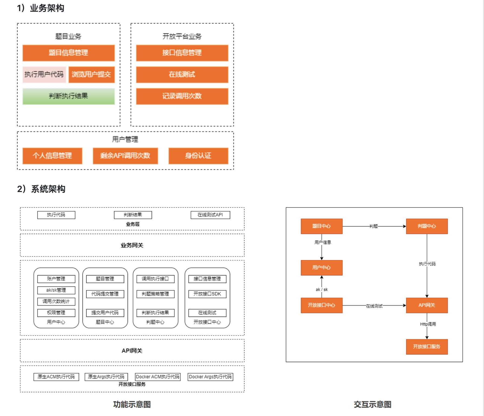

# HOJ在线判题模块后端部分


### 主流框架 & 特性

- Spring Cloud Alibaba
- Spring Boot 2.7.2
- Spring MVC
- MyBatis + MyBatis Plus 数据访问（开启分页）
- Spring Boot 调试工具和项目处理器
- Spring AOP 切面编程
- Spring 事务注解


### 数据存储

- MySQL 数据库
- Redis 内存数据库

### 工具类

- Hutool 工具库
- Apache Commons Lang3 工具类
- Lombok 注解
- 自定义SftpClient与FileUtil结合，实现不同远程服务器的文件操作
- 自定义数据库序列工具类

### 业务特性

- 业务代码生成器（支持自动生成 Service、Controller、数据模型代码）
- Spring Session Redis 分布式登录
- 全局请求响应拦截器（记录日志）
- 全局异常处理器
- 自定义错误码
- 封装通用响应类
- Swagger + Knife4j 接口文档
- 自定义权限注解 + 全局校验
- 全局跨域处理
- 长整数丢失精度解决
- 多环境配置


## 业务功能

## 业务功能

### 题目管理
- **创建题目**：支持基本信息（标题、描述、标签等）
- **编辑题目**：修改标题、描述、标签等
- **删除题目**：支持删除相关判题用例、提交记录等数据
- **更新题目信息**：包括内容和配置项
- **上传判题用例文件**：支持输入输出测试数据的管理
- **下载判题用例文件**：支持管理员查看和管理
- **题目数据库检索**：支持关键字、标签等条件筛选
- **题目提交结果统计**：统计题目的提交次数、通过率、平均得分等数据

### 代码沙箱与判题
- **代码编译与运行**：支持多种编程语言的代码执行
- **返回测试用例执行结果**：包含判题得分、运行时间、内存占用等
- **记录用户提交的代码执行结果**：支持查询历史提交记录
- **查看提交详情**：支持查看某次提交的详细判题信息（执行状态、错误信息、运行日志等）

### 用户管理
- **用户注册与登录**：支持账号+密码方式进行注册和登录
- **更新用户信息**：包括用户名、密码、个人简介等
- **上传与更新用户头像**
- **用户权限管理**：支持普通用户、管理员等角色划分
- **用户提交记录查询**：支持筛选历史提交的代码及判题结果


## 单元测试

- JUnit5 单元测试
- 示例单元测试类

## 架构设计
- 用户服务: 提供用户登录、用户信息的增删改查等功能
- 题目服务: 提供题目/题目提交记录的增删改查管理、题目提交功能
- 判题服务: 提供判题功能，调用代码沙箱并比对判题结果
- 代码沙箱: 提供编译执行代码、返回结果的功能
- 公共模块: 提供公共代码、如数据模型、全局请求响应封装、全局异常处理、工具类等
- 网关服务: 提供统一的API转发、聚合文档、全局跨域解决等功能

  

## 快速上手


### MySQL 数据库

1）修改 `.env` 的配置为你自己的：

```properties
# mysql
MYSQL_URL=jdbc:mysql://localhost:3306/hoj
MYSQL_USERNAME=root
MYSQL_PASSWORD=123456

# redis
REDIS_HOST=localhost
REDIS_PORT=6379

# nacos
NACOS_SERVER_ADDR=localhost:8848
NACOS_USERNAME=nacos
NACOS_PASSWORD=nacos

# rabbitmq
RABBITMQ_HOST=localhost
RABBITMQ_PORT=5672
RABBITMQ_USERNAME=guest
RABBITMQ_PASSWORD=guest

# sftp
SFTP_REMOTE_HOST=xxxxxxxx
SFTP_PORT=22
SFTP_USERNAME=xxxxxxx
SFTP_PASSWORD=xxxxxxxx
```
2）SpringBoot启动配置中选择该`.env`为环境变量

3）执行 `sql/create_table.sql` 中的数据库语句，自动创建库表

3）启动项目，访问 `http://localhost:8101/api/doc.html` 即可打开接口文档，不需要写前端就能在线调试接口了~


### Redis 分布式登录


1）修改 `application.yml` 中的 session 存储方式：

```yml
spring:
  session:
    store-type: redis
```

2）移除 `MainApplication` 类开头 `@SpringBootApplication` 注解内的 exclude 参数：

修改前：

```java
@SpringBootApplication(exclude = {RedisAutoConfiguration.class})
```

修改后：

```java
@SpringBootApplication
```
### RabbitMQ消息队列
```yml
spring:
  rabbitmq:
    host: "${RABBITMQ_HOST}"
    port: "${RABBITMQ_PORT}"
    username: "${RABBITMQ_USERNAME}"
    password: "${RABBITMQ_PASSWORD}"
```

### 业务代码生成器

支持自动生成 Service、Controller、数据模型代码，配合 MyBatisX 插件，可以快速开发增删改查等实用基础功能。

找到 `generate.CodeGenerator` 类，修改生成参数和生成路径，并且支持注释掉不需要的生成逻辑，然后运行即可。

```
// 指定生成参数
String packageName = "com.mirror.hoj";
String dataName = "用户评论";
String dataKey = "userComment";
String upperDataKey = "UserComment";
```

生成代码后，可以移动到实际项目中，并且按照 `// todo` 注释的提示来针对自己的业务需求进行修改。
